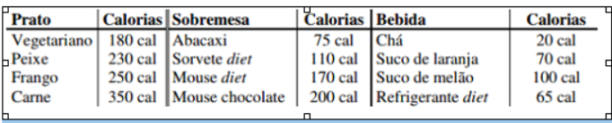
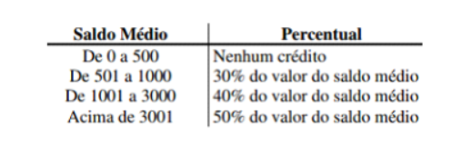

1-Criar um programa em Java, que informe a quantidade total de calorias de uma refeição a partir do usuário que deverá informar o prato, a sobremesa e a bebida (veja a tabela a seguir). 
 
 

Sugestão: enumere cada opção de prato, sobremesa e bebida. Ou seja: Prato: 1 - vegetariano, 2 – Peixe, 3 – Frango, 4 – Carne; Sobremesa: 1 – Abacaxi, 2 – Sorvete diet, 3 – Mouse diet, 4 – Mouse chocolate; Bebida: 1 – Chá, 2 - Suco de laranja, 3 – Suco de melão, 4 – Refrigerante diet.

2- Escreva um programa em Javascript, que leia um número e informe se ele é divisível por 10, por 5 ou por 2 ou se não é divisível por nenhum deles.

3- A CEF concederá um crédito especial com juros de 2% aos seus clientes de acordo com o saldo médio no último ano. Fazer um programa em JAVA que leia o saldo médio de um cliente e calcule o valor do crédito de acordo com a tabela a seguir. Imprimir uma mensagem informando o saldo médio e o valor de crédito.

 

4- Dados três valores A, B e C, construa um programa em Javascript, que mostre na tela os valores de forma descendente (do maior para o menor).

5- Crie um programa em javascript que leia a idade de uma pessoa e informe a sua classe eleitoral: 
 não eleitor (abaixo de 16 anos); 
 eleitor obrigatório (entre a faixa de 18 e menor de 65 anos);
  eleitor facultativo (de 16 até 18 anos e maior de 65 anos, inclusive).

6- Desenvolva um programa em javascript que leia um número inteiro e mostre na tela o seu antecessor e seu sucessor.

7- Fazer um programa que mostre na tela a média aritmética dos números 8,9 e 7. A média dos números 4, 5 e 6. A soma das duas médias. A média das médias.
8- Escrever um programa que leia:
- a porcentagem do IPI a ser acrescido no valor das peças 
- o código da peça 1, valor unitário da peça 1, quantidade de peças 1 
- o código da peça 2, valor unitário da peça 2, quantidade de peças 2 
O programa deve calcular o valor total a ser pago e apresentar o resultado. 
Cálculo : (valor1*quant1 + valor2*quant2)*(IPI/100 + 1)

9- Crie um programa que leia o valor do salário mínimo e o valor do salário de um usuário, calcule a quantidade de salários mínimos esse usuário ganha e imprima o resultado. (Salário mínimo = R$1.212,00).

10- Informar um saldo e mostrar na tela o saldo com reajuste de 1.5%.

11- Escrever um programa que leia o nome de um vendedor, o seu salário fixo e o total de vendas efetuadas por ele no mês (em dinheiro). Sabendo que este vendedor ganha 15% de comissão sobre suas vendas efetuadas, informar o seu nome, o salário fixo e salário no final do mês. 

12- Escreva um programa que calcule a soma dos números de 1 a 15. 

13- Ler uma temperatura em graus Celsius e apresentá-la convertida em graus Fahrenheit. A fórmula de conversão é: F=(9*C+160) / 5, sendo F a temperatura em Fahrenheit e C a temperatura em Celsius. 

14- Escreva um programa  que leia 10 números do usuário e calcule a soma desses números. 

15- Escreva um programa que leia a idade de 20 pessoas e exiba a soma das idades. 

16- Escreva um programa que leia a idade de 20 pessoas e exiba a média das idades. 

17- Escreva um programa que leia a idade de 20 pessoas e exiba quantas pessoas são maiores de idade. 

18- Escreva um programa que leia o nome e a idade de 10 pessoas e exiba o nome da pessoa mais nova. 

19- Elaborar um programa que efetue a apresentação do valor da conversão em real (R$) de um valor lido em dólar (US$). O programa deverá solicitar o valor da cotação do dólar e também a quantidade de dólares disponíveis com o usuário. 

20- Escreva um programa que leia 20 números do usuário e exiba quantos números são maiores do que 8. 

21- A Loja Mamão com Açúcar está vendendo seus produtos em 5 (cinco) prestações sem juros. Faça um programa que receba um valor de uma compra e mostre o valor das prestações.

22- Faça um programa que leia 20 números e, ao final, escreva quantos estão entre 0 e 100. 

23- Faça um programa que leia 20 números e, ao final, escreva quantos estão entre 0 e 100, quantos estão entre 101 e 200 e quantos são maiores de 200.

 24- Escreva um programa que leia uma sequência de números do usuário e realize a soma desses números. Encerre a execução quando um número negativo for digitado.

25 Escreva um programa que leia uma sequência de números do usuário e realize e a soma desses números. Encerre a execução quando um número negativo for digitado.

